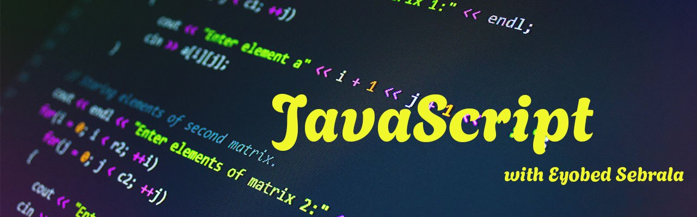

# JavaScript Basics: Exercises

Below are exercises for each foundational JavaScript topic. Complete each task to practice and reinforce your understanding.

## Table of Contents

1. [Exercise Console and console.log()](#1-exercise-console-and-consolelog)
2. [Exercise Variables](#2-exercise-variables)
3. [Exercise Data Types: Number](#3-exercise-data-types-number)
4. [Exercise Data Types: String](#4-exercise-data-types-string)
5. [Exercise Math Operators](#5-exercise-math-operators)
6. [Exercise Operator Precedence (BIDMAS)](#6-exercise-operator-precedence-bidmas)
7. [Exercise Shorthand Operators](#7-exercise-shorthand-operators)
8. [Exercise NaN](#8-exercise-nan)
9. [Exercise String Interpolation (Backticks)](#9-exercise-string-interpolation-backticks)
10. [Exercise Undefined](#10-exercise-undefined)
11. [Exercise Null](#11-exercise-null)
12. [Exercise Arrays](#12-exercise-arrays)
13. [Exercise Boolean Data Type](#13-exercise-boolean-data-type)
14. [Exercise Control Flow (Loops)](#14-exercise-control-flow-loops)
15. [Exercise Conditional Statements](#15-exercise-conditional-statements)
16. [Exercise Logical Operators](#16-exercise-logical-operators)
17. [Exercise Practice Exercise: Student Grading System](#17-exercise-practice-exercise-student-grading-system)
18. [Exercise Break and Continue](#18-exercise-break-and-continue-in-for-loop-with-if-clause)
19. [Exercise Switch Statement](#19-exercise-switch-statement)
20. [Exercise Variable and Block Scope](#20-exercise-variable-and-block-scope)
21. [Exercise Functions: Declaration, Expression, Arguments, and Parameters](#21-exercise-functions-declaration-expression-arguments-and-parameters)
22. [Exercise On DOM](#22-DOM-Exercise)

### 1. Exercise: Console and console.log()
**Task:** Use `console.log()` to print your name, your age, and a welcome message.

---

### 2. Exercise: Variables
**Task:** Declare variables for your name, age, and whether you are a student. Print each variable.

---

### 3. Exercise: Data Types: Number
**Task:** Create variables for height (in cm), weight (in kg), and age. Log them to the console.

---

### 4. Exercise: Data Types: String
**Task:** Store your first and last name in string variables. Combine them into a full name and print it.

---

### 5. Exercise: Math Operators
**Task:** Use `+`, `-`, `*`, `/`, and `%` with two numbers. Log each result.

---

### 6. Exercise: Operator Precedence (BIDMAS)
**Task:** Evaluate the expression `10 + 2 * 5 - (3 + 1)`. Log the result and explain why.

---

### 7. Exercise: Shorthand Operators
**Task:** Start with `let score = 10`. Use `+=`, `-=`, `*=`, and `/=` to update `score` and log the results.

---

### 8. Exercise: NaN
**Task:** Divide a number by a string (e.g., `10 / "abc"`). Log the result and check if it's `NaN`.

---

### 9. Exercise: String Interpolation (Backticks)
**Task:** Use template literals to log: `Hello, my name is NAME and I am AGE years old.` Use variables.

---

### 10. Exercise: Undefined
**Task:** Declare a variable without assigning a value. Log it to the console.

---

### 11. Exercise: Null
**Task:** Declare a variable and assign `null` to it. Log its value and type.

---

### 12. Exercise: Arrays
**Task:** Create an array of 5 favorite fruits. Print the third item and change the last item.

---

### 13. Exercise: Boolean Data Type
**Task:** Create a variable `isOnline` set to `true`. Toggle its value and print each state.

---

### 14. Exercise: Control Flow (Loops)
**Task:** Use a `for` loop to print numbers 1 through 10. Then use a `while` loop to print even numbers 2–20.

---

### 15. Exercise: Conditional Statements
**Task:** Write a program that checks age and prints "child", "teenager", or "adult".

---

### 16. Exercise: Logical Operators
**Task:** Create variables `isLoggedIn` and `isAdmin`. Use logical operators to determine access.

---

### 17. Exercise: Practice Exercise: Student Grading System
**Task:** Write a program that takes a score (0–100) and outputs a grade (A–F).

---

### 18. Exercise: Break and Continue (in for loop with if clause)
**Task:** Print numbers 1–10. Skip 5 using `continue` and stop at 8 using `break`.

---

### 19. Exercise: Switch Statement
**Task:** Use a switch statement to print whether a given day is a weekday or weekend.

---

### 20. Exercise: Variable and Block Scope
**Task:** Declare a variable inside and outside a block. Print both and explain the result.

---

### 21. Exercise: Functions: Declaration, Expression, Arguments, and Parameters
**Task:** Create a function `greet(name)` using both function declaration and expression. Log the result when called.

### 22. DOM Exercise

📝 1. Adding Content to the Browser
Exercise:
Create a 
 tag with your name and change it using JavaScript when the page loads.

🎨 2. Changing CSS Styles
Exercise:
Make a square with a red background and change it to green using JavaScript.

🖱️ 3. Reacting to User Events (Click)
Exercise:
Create a button that shows your favorite quote in an alert box when clicked.

🎉 4. Cool Effects (Popups)
Exercise:
Use prompt() to ask the user for their nickname, and then use alert() to welcome them.

➕ 5. Add or Delete Content
Exercise:
Add 2 new items to a list, then delete the first one using JavaScript.

🔍 6. Selecting Elements (Querying)
Exercise:
Use querySelectorAll() to select all paragraphs and change their color to purple.

🧾 7. innerText vs innerHTML
Exercise:
Create a 
 and use innerHTML to insert a bold welcome message.

2️⃣ 8. Modifying Elements
Exercise:
Change the content of a heading (<h1>) to your school’s name and change the font size and color.

3️⃣ 9. Creating and Removing Elements
Exercise:
Create a new 
 with your hobby and remove it after 5 seconds.

4️⃣ 10. Responding to User Events
Exercise:
Make a box that changes color when you hover over it and shows a message when you click it.
